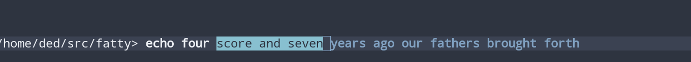
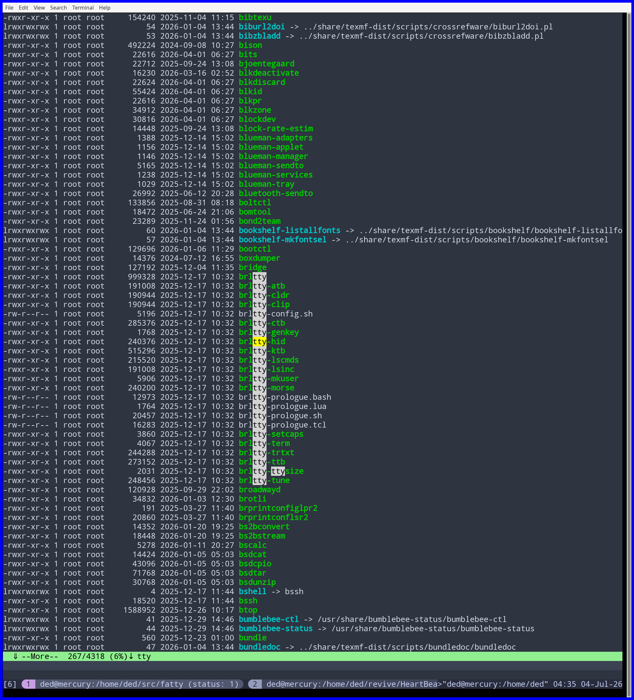
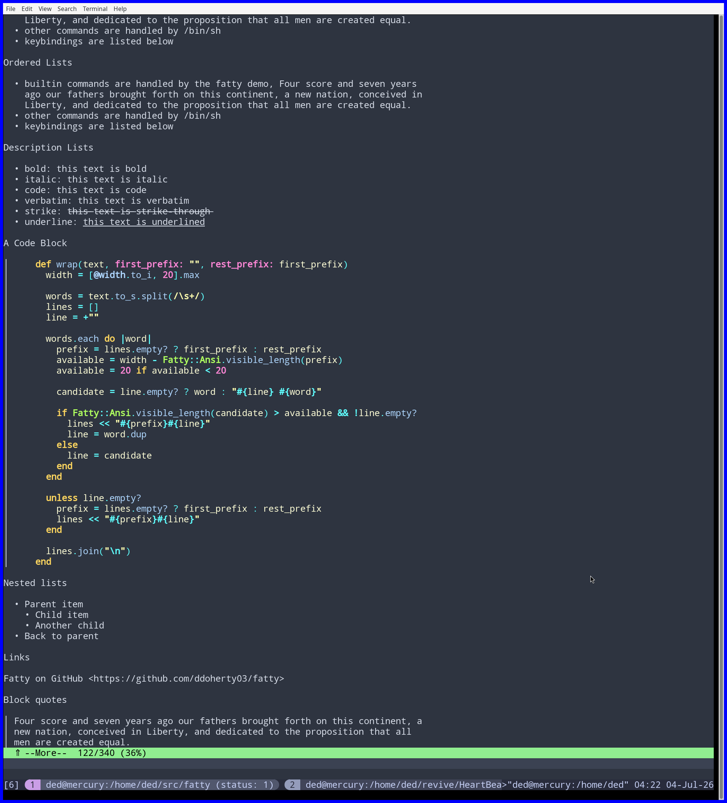
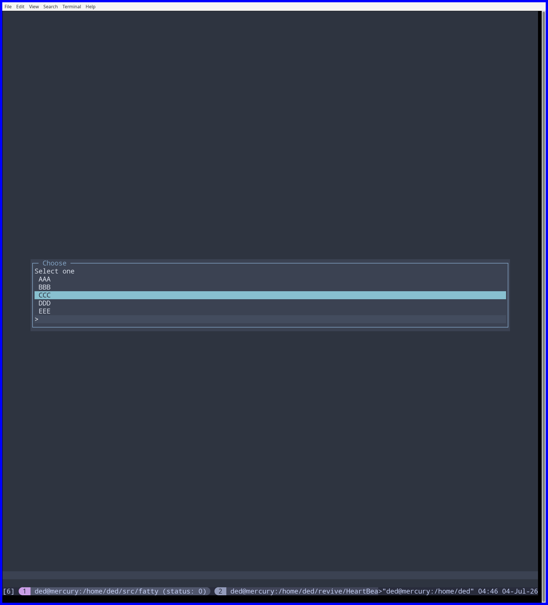

#+BEGIN_EXPORT markdown
#+PROPERTY: header-args:ruby :results value :colnames no :hlines yes :exports both :dir "./"
#+PROPERTY: header-args:ruby+ :wrap example :session fatty_session :eval yes
#+PROPERTY: header-args:ruby+ :prologue "$:.unshift('./lib') unless $:.first == './lib'; require 'fatty'"
#+PROPERTY: header-args:ruby+ :ruby "bundle exec irb"
#+PROPERTY: header-args:sh :exports code :eval no
#+PROPERTY: header-args:bash :exports code :eval no

#+END_EXPORT

#+PROPERTY: header-args:ruby :results value :colnames no :hlines yes :exports both :dir "./"
#+PROPERTY: header-args:ruby+ :wrap example :session fatty_session :eval yes
#+PROPERTY: header-args:ruby+ :prologue "$:.unshift('./lib') unless $:.first == './lib'; require 'fatty'"
#+PROPERTY: header-args:ruby+ :ruby "bundle exec irb"
#+PROPERTY: header-args:sh :exports code :eval no
#+PROPERTY: header-args:bash :exports code :eval no

* Introduction
~Fatty~ aims to provide a full-featured command-line environment that provides:

1. an emacs-like editing command-line input, including undo/redo and kill/yank
2. a history facility,
3. command completion,
4. completion of partially-typed file path names,
5. output into a paging environment,
6. searching within the paged output,
7. issuing messages to a "status" area separate from the output pane,
8. binding keys to pre-defined actions,
9. defining unrecognized key-codes as named keys,
10. color themes that can be selected in real time,
11. a way to define new themes,
12. processing completed command lines with a callback procedure of your
    choosing,
13. several user-interface widgets such a selection popups, text prompts,
    menus, progress bars, etc.,
14. a set of progress indicators you can use to display to the end user,
15. a way to render markdown to the output pane,

In other words, fatty allows you to write a terminal-based REPL of your choosing but takes
care of all the difficult parts.

~Fatty~ is written entirely in Ruby and was born from my frustrations at the
limitations of libraries like ~readline~ and ~reline~.  It relies on ~curses~
and ~truecolor~ for low-level rendering and is surprisingly snappy.

~Fatty~ is /not/ a terminal emulator but runs on top of one.

* Quick Start
** Installing
~Fatty~ is a ruby gem, so it can be installed with

#+begin_src sh :tangle no
  $ gem install fatty
#+end_src

** Trying it Out with the `fatty` Demo
Once installed, you can try out ~fatty~ with the included program called
~fatty~.  It allows you to easily exercise all of the important features of the
~fatty~ library.  At a normal shell prompt simply type ~fatty~, and it will
launch the ~fatty~ demo program.

Once inside ~fatty~ you will be prompted with a prompt that names your current
directory.  Type ~help~ to get a summary of the builtin commands available to
you.  If you type anything other than a builtin command, ~fatty~ attempts to
run it as a shell command and displays the output.

*** Builtin commands

Here are the commands builtin to =fatty=

| Command                     | Description                                                             |
|-----------------------------+-------------------------------------------------------------------------|
| help                        | Display this file on the output pane                                    |
| cd                          | Change the current directory used by the shell                          |
| choose                      | Present a series of choices in a popup window                           |
| choosevals                  | Also present choices in a popup window but return an associated value   |
| choose_multi                | Present choices with a "checkbox" for selecting multiple values         |
| choosevals_multi            | Also present a checkbox but return associated values                    |
| menu                        | Present a menu of labeled routines to run                               |
| info                        | Display an "info" message on the status line                            |
| good                        | Display a "good" message colored to indicate success                    |
| warn                        | Display a "warn" message colored to indicate caution                    |
| oops                        | Display an "oops" message colored to indicate failure                   |
| prompt                      | Popup a text box for entering a value in response to a prompt           |
| progress count <N>          | Display an animated progress indicator counting up to 40 or the given N |
| progress percent <N>        | Same but also show the percent complete                                 |
| progress simple_percent <N> | Same but show only the percent complete                                 |
| progress trail              | Show progress by displaying an "indicator" character for each step      |
| progress bar                | Show progress by a filling bar using ASCII characters                   |
| progress unicode_bar        | Same, but using unicode characters                                      |
| progress braille_bar        | Same, but using braille characters                                      |
| progress spinner            | Animate a "spinner" showing a busy state                                |
| markdown <file.md>          | Render the markdown file to the output pane; defaults to a demo file    |
| keytest                     | Enter key diagnostic mode report keycodes, key names, and bindings      |
| colors                      | Display ANSI, 256-color, and X11 color diagnostics                      |

*** Screenshots

**** Command line editing

Here is the command line, mid-edit showing a region selected and, in dim text
to the right, a predictive completion based on history.

#+CAPTION: Input editing showing region and predictive completion.
#+ATTR_HTML: :alt Fatty command line screenshot :width 900

**** Searchable Output

While paging output, you can search for words, as here the user searches for
the word =tty= in the output.  The current match is highlighted in yellow with
other matches highlighted in gray.  The paging status line shows the search
term and the direction of search.  The user can navigate for other matches in
the output using =n= and =N=.

#+CAPTION: Searching for instances of =tty= in the output.
#+ATTR_HTML: :alt Fatty search pane :width 900

**** Paging Markdown

The ~fatty~ demo running the =markdown= command and paging the output.  It
shows =fatty's= ability to render markdown using ANSI codes, including
colorizing code blocks, as well as its paging interface.

#+CAPTION: Running the =fatty= demo =markdown= command.
#+ATTR_HTML: :alt Fatty terminal UI demo screenshot :width 900

**** Popup Selection
One of the many "widgets" available through =fatty= is the ability to present
the user with a set of choices to select from.  After running the demo's
=choose "AAA" "BBB" "CCC" "DDD" "EEE"=

#+CAPTION: Running the =fatty= demo =choose= command.
#+ATTR_HTML: :alt Fatty terminal UI demo screenshot :width 900

* Quick Start

* Usage
** Launching a Fatty Terminal with ~on_accept~
You can launch a ~Fatty~ terminal session that does arbitrary processing of an
edited command line and returns a String to be displayed on the output pane,
as shown in this file that we'll call ~loudrev~:

#+begin_src ruby :tangle no
  #! /usr/bin/env ruby
  # -*- mode: ruby -*-

  require 'fatty'

  loud_reversal = lambda do |line|
    line.upcase.reverse
  end

  Fatty::Terminal.new(
    on_accept: loud_reversal,
  ).go
#+end_src

Now you have an interactive application that allows you to type text and see
what it looks like when written backwards in uppercase letters. It's as easy
as that!

Text passed to the output pane, the status area, and the alert pane may
contain ANSI SGR color/style sequences. Fatty interprets those sequences
relative to the current theme and role, so an ANSI reset returns to the active
Fatty role rather than to the terminal's physical default colors.  =fatty=
includes the nice [[https://github.com/ku1ik/rainbow][=Rainbow= gem]] for colorizing text as a convenience.

When a =fatty= application runs, =fatty= installs a few files if they do not
exists:

- a history file at =~/.fatty_history=
- a config directory at =~/.config/fatty= that contains
  + =config.yml=, the main configuration file
  + =keydefs.yml=, a file for associating keycodes emitted by the underlying
    terminal with names when curses does not do so automatically,
  + =keybindings.yml=, a file for associating named keys with actions above
    and beyond the emacs bindings that are used by default, and
  + =themes=, a directory of pre-defined theme definitions that you can choose
    from and add to by adding your own themes.

** Parameters to =on_accept=
The =on_accept= proc passed to an instance of =Fatty::Terminal= can take one
or two parameters: (1) =line=, the edited line as it exists when the user
types =RETURN= and (2) an optional callback parameter that you can use to
access the facilities of =fatty=.

** The =line= parameter to =on_accept=
=Fatty= does not parse command lines for your application.  When the user
accepts a =line=, =Fatty= passes the line to =on_accept= as text.  It is up to
your callback to decide whether to strip whitespace, split words, interpret
quotes, parse options, recognize subcommands, or treat punctuation specially.

This keeps =Fatty= useful for many different kinds of REPLs.  Some applications
want shell-like parsing.  Others want to preserve the user's input exactly.

For shell-like parsing, Ruby's standard =Shellwords= library is often useful:

#+begin_src ruby :tangle no
  #! /usr/bin/env ruby
  # -*- mode: ruby -*-

  require 'fatty'
  require 'shellwords'

  runner = lambda do |line, fatty|
    words = Shellwords.split(line)

    case words
    when ["echo", *rest]
      fatty.append("#{rest.join(" ")}\n")
    when ["count", *rest]
      fatty.append("#{rest.length}\n")
    when []
      fatty.status("Blank line", role: :info)
    else
      fatty.alert("Unknown command: #{words.first}", role: :warn)
    end
  rescue ArgumentError => e
    fatty.alert("Could not parse line: #{e.message}", role: :error)
  end

  Fatty::Terminal.new(
    prompt: "shellwords> ",
    on_accept: runner,
  ).go
#+end_src

** The callback parameter to =on_accept=
The =on_accept= proc can have a second parameter named whatever you like that
serves as a callback into certain facilities provided by =fatty=.  In this
README we use the name =fatty= for the callback parameter since it provides
access to the facilities provided by the =fatty= library.  Here is a variation
of the prior example that also echoes the original typed string into the
so-called status area:

#+begin_src ruby :tangle no
  #! /usr/bin/env ruby
  # -*- mode: ruby -*-

  require 'fatty'

  loud_reversal = lambda do |line, fatty|
    fatty.good(line)
    line.upcase.reverse
  end

  Fatty::Terminal.new(
    on_accept: loud_reversal,
  ).go
#+end_src

The callback parameter responds to several methods that allow your
application to interact with the user.  They are documented below.

** Output Ordering
The =on_accept= callback can send text to the output pane in three ways:

1. by returning a value from the callback;
2. by calling =append= or =markdown= on the callback environment; or
3. by calling =append_now= on the callback environment.

A returned =String= is the simplest output mechanism.  It is displayed after
the callback finishes:

#+begin_src ruby :tangle no
  Fatty::Terminal.new(
    on_accept: ->(line) { line.upcase.reverse },
  ).go
#+end_src

Calls to =append= and =markdown= also queue output until the callback finishes.
If a callback both calls =append= or =markdown= and returns a =String=, the
queued output is displayed first and the returned string is displayed after it.

Calls to =append_now= are different.  They append text and immediately render a
frame, so the user can see output while the callback is still running.  Use
=append_now= for long-running callbacks that should stream progress to the
output pane.

At the end of the callback, =Fatty= finishes the command and updates the pager
state.  Output produced with =append_now= may therefore appear during the
callback, while output from =append=, =markdown=, and the callback's return
value appears after the callback returns.

* Default Interaction
** Parts of the Screen
*** Input Field
Just above the bottom of the screen where all the action takes place: it is a
line for editing the input.  It displays a prompt followed by an area in which
you build the command line using =fatty's= editing facilities.

*** Output Pane
Most of the top part of the screen is reserved for displaying whatever output
is sent to it with the =on_accept= callback to the =Terminal=.  It can render
colored ANSI-encoded strings and will page long output so you can view it a
page at a time and even search the output.

*** Status Area
The one to four lines just above the Input Field that displays output to the
user that is out of band for the Output Pane.  Brief messages of confirmation,
warning, or error can be displayed there so as to get the user's immediate
attention.  Progress bars also render there where their visibility is made
prominent.

*** Alert  Area
Alerts are short-lived, non-scrolling messages shown below the input field.
They are intended for user-visible conditions that require attention.  =Fatty=
uses this area to warn the user of unrecognized key codes and of unbound key
presses.

** Command-line Editing
** Keybindings

The following tables explain the keybindings available in `fatty` in different
contexts.  Named keys are indicated by `:name` and key categories, such as
`<digits>` are indicated with brackets.

*** Input Context

When editing the input line or text input for widgets like the `prompt`,
`fatty` provides emacs-like editing keybindings by default.  Many of these
commands can take a count prefix argument to repeat the command count times.
For example, `M-8 M-0 #` will insert 80 '#' characters at the cursor.

| Key        | Description                                           |
|------------+-------------------------------------------------------|
| C-a        | move to the beginning of the line                     |
| :home      | move to the beginning of the line                     |
| C-e        | move to the end of the line                           |
| :end       | move to the end of the line                           |
| C-f        | move cursor right one character                       |
| :right     | move cursor right one character                       |
| C-b        | move cursor left one character                        |
| :left      | move cursor left one character                        |
| M-f        | move cursor right one word                            |
| M-:right   | move cursor right one word                            |
| C-:right   | move cursor right one word                            |
| M-b        | move cursor left one word                             |
| M-:left    | move cursor left one word                             |
| C-:left    | move cursor left one word                             |
| C-t        | transpose characters                                  |
| M-t        | transpose words                                       |
|            |                                                       |
| C-d        | delete character at cursor                            |
| :delete    | delete character at cursor                            |
| :backspace | delete character before cursor                        |
| M-d        | kill word at cursor                                   |
| C-w        | kill word before cursor                               |
| C-k        | kill to end of line                                   |
|            |                                                       |
| C-/        | undo                                                  |
| C-_        | undo                                                  |
| C-M-/      | redo                                                  |
| M-/        | redo                                                  |
|            |                                                       |
| C-:space   | set the mark at the current cursor position           |
| C-@        | set the mark at the current cursor position           |
| C-g        | clear the mark                                        |
| C-w        | kill the region                                       |
| M-w        | copy the region                                       |
|            |                                                       |
| C-y        | yank last kill at cursor                              |
| M-y        | replace last yank with next in kill ring              |
|            |                                                       |
| C-u        | universal count argument (time 4 each press)          |
| M-<digit>  | accumulate count argument                             |
|            |                                                       |
| C-p        | replace the line with the prior history item          |
| :up        | replace the line with the prior history item          |
| C-n        | replace the line with the next history item           |
| :down      | replace the line with the next history item           |
| C-r        | search the history in a popup                         |
|            |                                                       |
| :enter     | feed the line to the on_accept proc and page output   |
| M-:enter   | feed the line to the on_accept proc and scroll output |
| C-c        | quit `fatty`                                          |
| C-d        | quit `fatty` only if the input line is empty          |
| C-l        | clear the output pane                                 |
|            |                                                       |

*** Paging Context

By default, `fatty` sends output to the large output pane, and if the output
is more than one screen long presents a paging environment for viewing and
searching the environment.

| Key   | Description               |
|-------+---------------------------|
| :up   | move output one line up   |
| k     | move output one line up   |
| :down | move output one line down |
| j     | move output one line down |
|       |                           |

** Paging
** Markdown
*** Forced line breaks
Use ~ ~ to force a line break.

#+begin_example
This line has a forced line break   and this should appear on the next line.
#+end_example

will render as

#+begin_example
This line has a forced line break
and this should appear on the next line.
#+end_example

* Configuration
** Key Codes
** Key Bindings
** Themes
** Plugins
